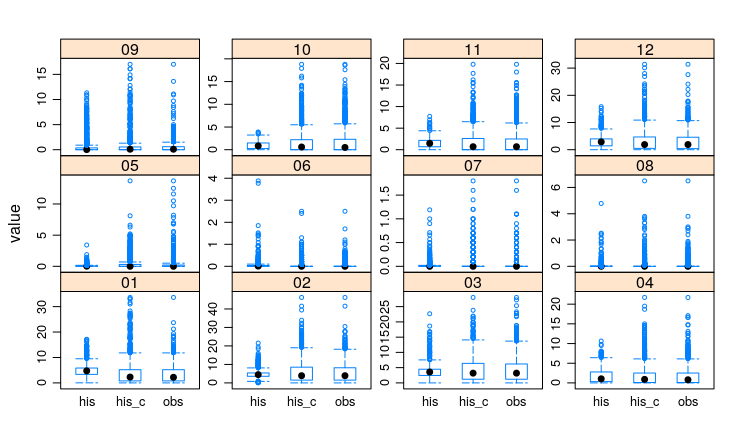

# CMIP5_GCC

Monthly empirical quantile mapping method to CMIP5 data (point-station scale) following the method of [Gudmundsson et al. (2012)](https://hess.copernicus.org/articles/16/3383/2012/hess-16-3383-2012.html).

  

*Figure. Boxplot of historical (his), corrected-historical (his_c) and observed (obs) daily precipitation by month.*